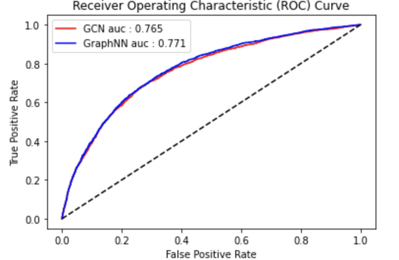

# GNNs for End-to-End Particle Identification with the CMS Experiment

## Task 1 : Electron/photon classification

Use a deep learning method of your choice to achieve the highest possible
classification on this dataset (we ask that you do it both in Keras/Tensorflow and in
PyTorch). Please provide a Jupyter notebook that shows your solution. The model you
submit should have a ROC AUC score of at least 0.80.

Description: 32x32 matrices (two channels - hit energy and time) for two classes of
particles electrons and photons impinging on a calorimeter

Datasets : [photons](https://cernbox.cern.ch/files/public/show/AtBT8y4MiQYFcgc?sort-by=name&sort-dir=asc&items-per-page=100) and [electrons](https://cernbox.cern.ch/files/public/show/FbXw3V4XNyYB3oA?sort-by=name&sort-dir=asc&items-per-page=100)

## Task 2 : Deep Learning based Quark-Gluon Classification

Description: 125x125 matrices (three channel images) for two classes of particles quarks and gluons impinging on a calorimeter.
For description of 1st dataset please refer to the link provided for the dataset.

Use a Convolutional Neural Network (CNN) architecture of your choice to achieve the highest possible classification on this dataset (in your preferred choice of framework for example: Tensorflow/Keras or Pytorch). Please provide a Jupyter notebook that shows your solution.

Daatasets : [Link](https://cernbox.cern.ch/index.php/s/hqz8zE7oxyPjvsL)

## Specific Task : Graph Neural Networks

Choose 2 Graph-based architectures of your choice to classify jets as being
quarks or gluons. Provide a description on what considerations you have taken to
project this point-cloud dataset to a set of interconnected nodes and edges.

Discuss the resulting performance of the 2 chosen architectures.

Datasets (Same as Task2) : [Link](https://cernbox.cern.ch/index.php/s/hqz8zE7oxyPjvsL)

## requirements.txt

Install the required dependencies. The model in Task-2 is built using ```pytorch-geometric``` and ```energyflow``` which need to be installed. Specify your torch and cuda version in the speicfied brackets.

```pip
pip install pyg_lib torch_scatter torch_sparse torch_cluster-f https://data.pyg.org/whl/torch-${TORCH}+${CUDA}.html 
pip install torch-geometric
```

For example with ```torch==1.13.1``` and ```cuda==11.6```

```pip
pip install pyg_lib torch_scatter torch_sparse torch_cluster-f https://data.pyg.org/whl/torch-1.13.1+cu116.html
pip install torch-geometric
```

## Description of the files

This repository contains one folder for each task and a ```requirements.txt``` file.

### Task 1 <br>
- ```task1/TASK.ipynb``` : Notebook containing all the code for task1
- ```task1/TASK1.ipynb - Colaboratory.pdf``` : pdf version of the notebook.
- ```task1/roc-curve.png``` : Plot of the roc curve of the model

### Task 2 <br>
- ```task2/quark-gluon-cnn.ipynb``` : Notebook containing all the code for task2
- ```task2/quark-gluon-cnn.ipynb - Colaboratory.pdf``` : pdf version of the notebook.
- ```task2/roc-curve.png``` : Plot of the roc curve of the model

### Specific Task <br>
- ```specific_task/quark-gluon-gnn.ipynb``` : Notebook containing all the code for specific task.
- ```specific_task/quark-gluon-gnn.ipynb - Colaboratory.pdf``` : pdf version of the notebook.
- ```specific_task/roc-curve.png``` : Plot of the roc curve of the model


## Model Architecture

### Task 1 

Used a modified ResNet-15 model and hyperparameters as explained in the paper [End-to-End Physics Event Classification with CMS Open Data](https://arxiv.org/abs/1807.11916). <br>

Trained both keras and pytorch models achieveing 0.8078 AUC-ROC score.

### Task 2

Simple vanilla CNN architecture. 
 - 2x Conv-->Relu-->MaxPool
 - Linear-->Relu-->Linear
 - Adam optimizer with learning rate 5e-4 which halves every 10 epochs.
 - Defining CrossEntropyLoss function

### Specific Task

Graph Construction -

1. Treat all 125x125 pixels as nodes of the graph.
2. Keep only the nodes having non-zero absolute sum of channel values. This helps convert the image to a point-cloud representation.
3. Now, for each node take the nearest k(=6) neigbours as the edge indices.
4. The node features are set as the channel values hence we get 3 features per node.

#### Architecture-1

- 3-layer GCN network with relu for aggregation of node-level features.
- Readput layer as global mean pooling for graph-level embedding.
- A dropout layer followed by linear layer.

#### Architecture-2

- Use of GraphConv layer in-place of GCN layer. It adds skip connections in the network tp preserve central node information and omits neighborhood normalization completely.
- The same readout layer with gloab_mean_pooling is used. I also tried using a combination of global_mean and global_max pool but it lead to decrease in performance.
- This is followed by an additional linear layer with relu. Then a dropout and final linear layer.

## Results

### Task 1

#### Keras-Implementation
- Testing Accuracy 0.737
- F1 score: 0.737
- ROC-AUC: 0.8078

#### PyTorch-Implementation
- Testing Accuracy 0.736
- F1 score score: 0.738
- ROC-AUC score: 0.8058

#### ROC Curve

<p align="center">
  
</p>

### Task 2

#### Metrics
- Testing Accuracy: 0.935
- F1 score: 0.935
- ROC-AUC: 0.9558

#### ROC Curve

<p align="center">
  
</p>

### Specific Task

#### Architecture-1
- Testing Accuracy 0.693
- F1 score: 0.654
- ROC-AUC: 0.765
 
#### Architecture-2
- Testing Accuracy 0.696
- F1 score: 0.730
- ROC-AUC: 0.771 

#### ROC Curve

<p align="center">
  
</p>


